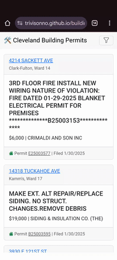

# 🛠️ Cleveland Building Permits Viewer
*A web app to explore building permits in Cleveland, OH using real-time data from the city's open data portal.*

  


---

## 📌 About the Project
This project provides an interactive interface for users to **search, filter, and explore building permits** in Cleveland, Ohio. The app pulls **live permit data** directly from the **City of Cleveland's Open Data Portal** and presents it in a user-friendly format.

### 🔹 Features
- 📍 **Search by Address & Work Description**
- 🏠 **Filter by Permit Category, Neighborhood, and Permit Type**
- 📊 **Sort by Date or Job Value**
- 🔄 **Infinite Scroll for Loading More Results**
- 📌 **View Contractors & Costs for Permits**
- 📍 **Click on Addresses to Open in Google Maps**
- 📚 **FAQ Section for Quick Help**
- 📈 **Airtable Logging for Non-Default Search Queries**

---

## 💽 Data Source
The building permit data is provided by the **City of Cleveland's Open Data Portal**:  
🔗 [Cleveland GIS - Building Permits](https://data.clevelandohio.gov/datasets/ClevelandGIS::building-permits/about)

We greatly appreciate the **City of Cleveland** for making this data publicly available!

---

## 🚀 How It Works
1. The app queries data from the **City of Cleveland’s ArcGIS REST API**.
2. Users can **search**, **filter**, and **sort** permits using an intuitive interface.
3. Clicking an address opens **Google Maps** to show the location.
4. **Airtable logs** search queries (except default searches) to track trends and improve features.

---

## 📚 FAQ
### 🔹 Where does the data come from?
The data is sourced directly from the **City of Cleveland's Open Data Portal**.

### 🔹 How do I search for permits?
Enter an **address or work description** in the search fields, apply any filters, and hit **Search**.

### 🔹 How do I reset my search?
Click the **Clear** button to reset all filters and search terms.

### 🔹 Why are there no results?
- The City may not have published data for your search.
- Try adjusting filters or searching for different keywords.

---

## 🛠️ Installation & Development
### 🔹 Requirements
- **Airtable Account** (for logging queries)
- **Airtable API Key & Base ID**
- **Google Chrome / Firefox** (for best performance)

### 🔹 Clone the Repository
```sh
git clone https://github.com/trivisonno/building-permit-v1.git
cd building-permit-v1
```

### 🔹 Configuration
1. **Set up Airtable**:
   - Create a **Logs Table** in Airtable with these fields:
     - `Session UUID` (Single Line Text)
     - `User-Agent` (Single Line Text)
     - `Screen Width` (Number)
     - `Screen Height` (Number)
     - `Category` (Single Line Text)
     - `Neighborhood` (Single Line Text)
     - `Subtype` (Single Line Text)
     - `Search Query` (Single Line Text)
     - `Address Query` (Single Line Text)
     - `Sort Order` (Single Line Text)
     - `Result Offset` (Number)
     - `Append Operation` (Checkbox)
   - Get your **Airtable API Key & Base ID**.

2. **Edit the JavaScript Configurations**:
   - Replace placeholders in `logSearchQuery()` with your **Airtable API Key & Base ID**.

### 🔹 Run the Project Locally
Simply open `index.html` in your browser.

---

## 🤝 Contributing
We welcome contributions! Here's how you can help:
1. **Fork the repo** on GitHub.
2. **Clone** your fork:
   ```sh
   git clone https://github.com/YOUR_USERNAME/building-permit-v1.git
   ```
3. **Create a new branch** for your feature:
   ```sh
   git checkout -b feature-name
   ```
4. **Commit your changes** and push the branch:
   ```sh
   git commit -m "Added feature XYZ"
   git push origin feature-name
   ```
5. **Create a Pull Request (PR)** and describe your changes.

---

## 🔧 Future Enhancements
- 📍 **Map View for Visualizing Permits**
- 🔔 **Email Notifications for New Permits in a Selected Area**
- 📊 **Permit Trends & Statistics Dashboard**
- 🏠 **Contractor Lookup for Related Permits**
- 🚀 **Performance Improvements & More Filters**

---

## 📚 License
This project is licensed under the **MIT License**. See [LICENSE](LICENSE) for details.

---

## 💡 Credits
👨‍💻 **Developed by:** [Angelo Trivisonno](https://github.com/trivisonno)  
📊 **Data Provided by:** City of Cleveland  
💻 **Source Code:** [GitHub Repository](https://github.com/trivisonno/building-permit-v1)  

